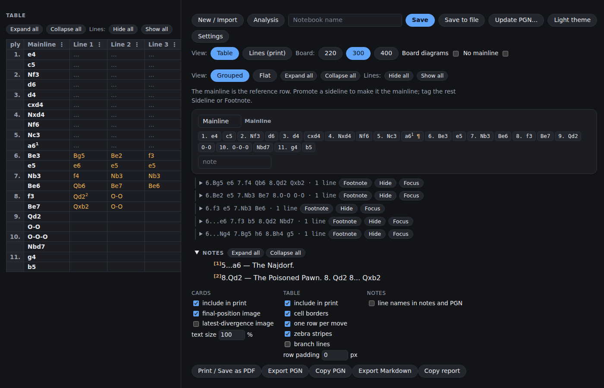
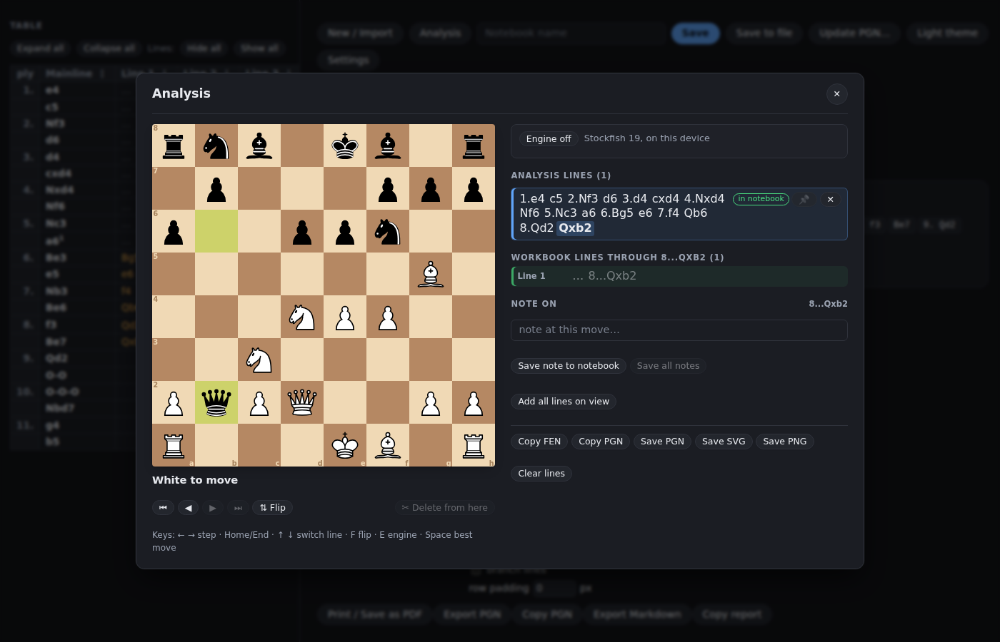
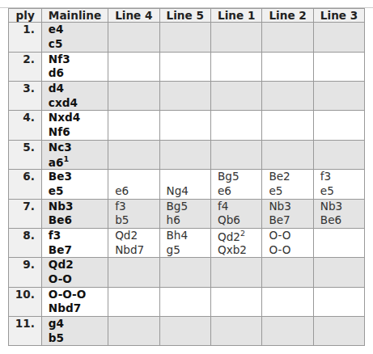

# Chess Opening Theory Table Builder

**[Open the app →](https://davis-pies.github.io/chess-pgn-reports/)**

Turn a chess PGN into a printable **opening theory table** in the style of
ECO / MCO / Nunn's Chess Openings. It is a static site: no backend, no
accounts. Your workbooks are saved in your own browser's `localStorage`, or to
a `.json` file you keep.



## Features

- **Import** a PGN by pasting it or opening a file. Every `(...)` variation
  becomes its own line; `{...}` comments become numbered notes.
- **Tag** each line as a sideline or a footnote, name it, give it an
  evaluation symbol (=, ±, ∞, !, ?, …), hide it, or promote it to the
  mainline. Or tick **No mainline** to treat every line as a peer.
- **Read** the grouped table: lines that share moves are folded into one
  column you can open level by level, and clicking a move traces its whole
  line.
- **Analyse** on an interactive board: play moves, build several lines at
  once, write notes, and add what you found to the workbook. Save the board
  as a PNG or SVG, or its lines as PGN. Stockfish 19 runs locally in your
  browser; nothing is sent anywhere.
- **Print** a paper-saving report (**Print → Save as PDF**): tables headed by
  the moves their lines share, sliced to fit the page, with footnotes and
  lettered sub-notes.
- **Summarise** the report at its head: the title, the opening and ECO, the
  source game when the PGN names its players, how many lines and notes
  follow, and a tally of how the lines end. **Game info…** edits that header.
- **Export** to PGN or Markdown, or save the whole workbook to a `.json` file.
- **Update the PGN** under your annotations: notes, symbols and tags follow
  the moves to the new file, with a preview of anything that would be lost.
- **Use it on a phone or tablet**: the layout stacks on narrow screens, and
  touch gets swipe-to-step on the board and long-press menus in the table.
- **Pick up where you left off**: the app remembers your theme, board
  orientation, panel width and last workbook in this browser (**Settings**).





The [user guide](docs/user-guide.md) walks through every feature in detail.

## Quick start

Use the [hosted app](https://davis-pies.github.io/chess-pgn-reports/), paste a
PGN such as

```text
1. e4 c5 2. Nf3 d6 3. d4 cxd4 4. Nxd4 Nf6 5. Nc3 a6 { The Najdorf. }
6. Be3 (6. Bg5 e6 7. f4 Qb6) (6. Be2 e5) 6... e5 *
```

and press **Load & Tag**. With no PGN at all, **Start from a board** opens the
analysis board on the starting position so you can build a repertoire from
nothing.

## Development

Requires Node 22 (CI runs 22; `node --test` needs 21+ to expand its glob).

```bash
npm install
npm run dev        # http://127.0.0.1:8000, live reload on save
```

`npm run dev` runs `tools/dev-server.mjs`, a dependency-free static server
that injects a live-reload snippet into HTML responses; `index.html` on disk
stays exactly what GitHub Pages serves. It watches `src/`, `assets/`,
`index.html` and `style.css`. Pass a port if 8000 is taken:
`npm run dev -- 8080`.

It deliberately does not bundle. `index.html` resolves `chess.js` through an
importmap pointing at esm.sh, and a bundler would rewrite that to a
`node_modules` path, so development would load a different chess.js from the
deployed site. Any plain static server works too (`python3 -m http.server`),
just without the reload.

The checks CI runs on every pull request (`npm run check` runs the first
four together):

| Command | What it checks |
| ------- | -------------- |
| `npm run lint` | ESLint, with warnings failing too (`npm run lint:fix` to auto-fix) |
| `npm run knip` | no unused files, exports or dependencies |
| `npm test` | the `node:test` suite under `tests/`, with jsdom for the DOM |
| `npm run coverage:check` | the same suite with coverage floors: 97% lines, 87% branches, 97% functions |
| `npm run test:e2e` | browser tests in `e2e/`, Playwright + Chromium |

The browser tests start the dev server themselves and drive the real page:
importing, the report's editor, the analysis board, the engine, saving and
reopening workbooks. They answer the importmap's esm.sh request for chess.js
from `node_modules`, so they run offline. First run needs a browser:
`npx playwright install chromium`.

See [docs/architecture.md](docs/architecture.md) for how the code is laid
out, and [CLAUDE.md](CLAUDE.md) for the conventions contributors (human or
AI) are expected to follow.

## Deploy to GitHub Pages

There is no build step; the repository root is the site.

1. Repo → **Settings → Pages**.
2. Under **Build and deployment**, Source: **Deploy from a branch**.
3. Branch: `master`, folder: `/ (root)`. Save.
4. The site appears at `https://<user>.github.io/<repo>/` within a minute.

Because it is fully client-side, the same URL works in a phone's browser.

## License

The project's own source is released under the [MIT](LICENSE) license.

The analysis engine in `vendor/stockfish/` is Stockfish (Stockfish.js),
distributed unmodified under the GNU GPL v3; it runs as a separate program in
a Web Worker. See [vendor/stockfish/README.md](vendor/stockfish/README.md).

The chess piece graphics in `assets/pieces.svg` are third-party work by
Wikimedia Commons user *Cburnett*, used under the BSD 3-clause license. See
[THIRD-PARTY-NOTICES.md](THIRD-PARTY-NOTICES.md) for the full text and
attribution.
